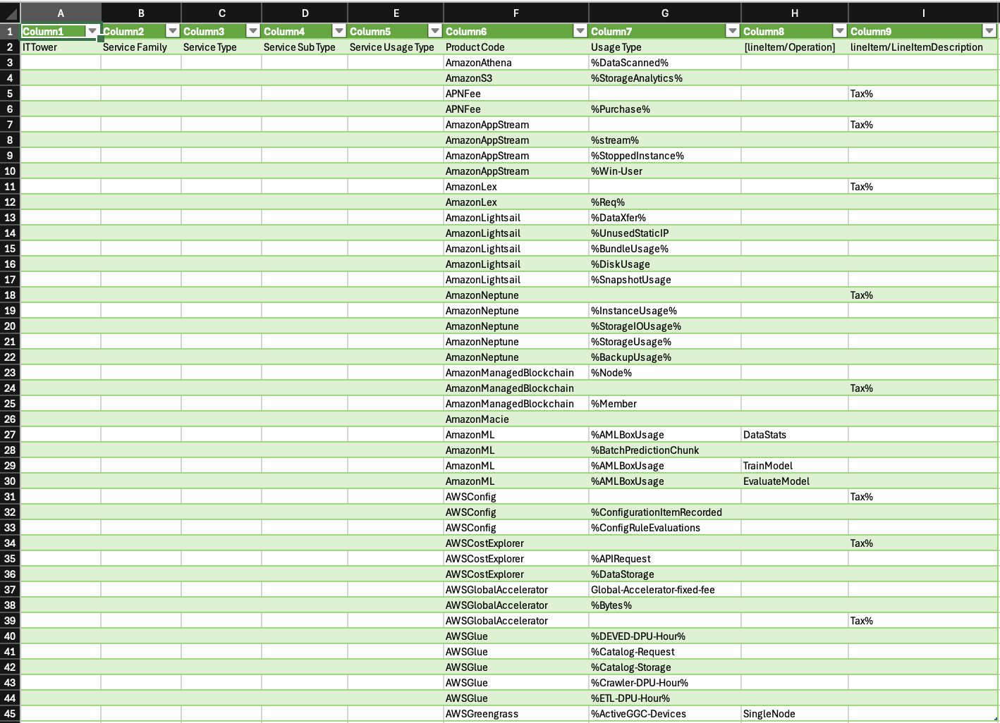
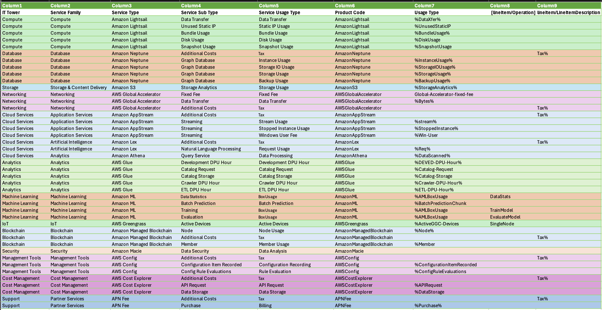

# Лабораторная работа 1. Знакомство с IaaS, PaaS, SaaS сервисами в облаке на примере Amazon Web Services (AWS). Создание сервисной модели.

## Цель работы
Знакомство с облачными сервисами. Понимание уровней абстракции над инфраструктурой в облаке. Формирование понимания типов потребления сервисов в сервисной-модели. 

## Дано
1. Слепок данных биллинга от провайдера после небольшой обработки в виде SQL-параметров.
Символ `%` в начале/конце означает, что перед/после него может стоять любой набор символов.  
2. Образец итогового соответствия, что желательно получить в конце. В этом же документе.

## Необходимо
1. Импортировать файл **.csv** в Excel или любую другую программу работы с таблицами.  
  Для Excel делается на вкладке **Данные → Из текстового / csv файла** – выбрать файл, разделитель – точка с запятой.
2. Распределить потребление сервисов по иерархии, чтобы можно было провести анализ от большего к меньшему  
  (напр. От всех вычислительных ресурсов **Compute** дойти до конкретного типа использования – **Dedicated host usage**).
3. Сохранить файл и залить в соответствующую папку на Google Drive.

Наш вариант:

---

## Алгоритм работы
Сопоставить входящие данные от провайдера с его же документацией. Написать в соответствие колонкам справа значения 5 колонок слева, которые бы однозначно классифицировали тип сервиса. Для столбцов IT Tower и Service Family значения можно выбрать из образца.

---

## Ход работы

### **Сервисы, которые встретились**

#### **Amazon Lex**
Сервис для создания голосовых и текстовых чат-ботов с использованием технологий обработки естественного языка.  
Используется для разработки приложений с интерфейсом разговорной речи.

#### **Amazon Machine Learning**
Сервис машинного обучения, позволяющий разрабатывать и обучать модели на основе данных.  
Используется для подготовки данных, предсказаний и оценки качества моделей.

#### **Amazon Athena**
Сервис для выполнения SQL-запросов на данных, хранящихся в Amazon S3.  
Работает в режиме **serverless**, поэтому не требует управления инфраструктурой.

#### **AWS Glue**
Сервис ETL для подготовки и обработки данных.  
Поддерживает каталоги данных, краулеры и DPU-часы для выполнения ETL-задач.

#### **Amazon Managed Blockchain**
Сервис управления блокчейн-сетями, позволяющий создавать и масштабировать сети для безопасных транзакций.

#### **Amazon Lightsail**
Сервис виртуальных частных серверов с упрощенной настройкой и управлением ресурсами.

#### **Amazon Neptune**
Графовая база данных для хранения и обработки графов с низкой задержкой и высокой производительностью.

#### **AWS Config**
Сервис для управления конфигурацией и отслеживания изменений в ресурсах AWS.

#### **AWS Cost Explorer**
Инструмент для анализа и оптимизации затрат в облачной среде AWS.

#### **AWS Global Accelerator**
Сервис для ускорения доставки трафика по глобальной сети AWS с низкой задержкой.

#### **Amazon Macie**
Сервис безопасности для обнаружения и защиты конфиденциальных данных.

#### **Amazon S3**
Объектное хранилище для хранения и аналитики данных, обеспечивающее масштабируемость и высокую доступность.

#### **AWS IoT Greengrass**
Сервис для управления устройствами на краю сети и выполнения локальных вычислений.

#### **AWS Partner Network**
Сервис партнерской программы AWS с возможностью закупки дополнительных услуг.

---

## Что мы сделали

Мы импортировала данные из файла, затем, с помощью документации AWS и гугла, дозаполнили таблицу на основе **Product Code** и **Usage Type** и информации из последних столбцов. Затем нужно было выстроить определенную иерархию, у нас иерархия строится от общего к частному и по вкладу в производительность системы.

---

## Результат

---

## Вывод

В результате выполнения лабораторной работы мы познакомились с облачными сервисами AWS, классифицировали их по уровням и заполнили соответствующую таблицу.
